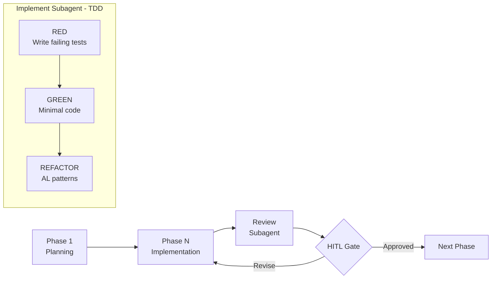

# AL Development Collection for GitHub Copilot

> **ALDC** — Skills-based, spec-driven, TDD-orchestrated development framework for Microsoft Dynamics 365 Business Central with GitHub Copilot agents.
>
> From vibe coding to controlled engineering.

[](docs/framework/ALDC-Core-Spec-v1.1.md)
[](CHANGELOG.md)
[](https://danielmeppiel.github.io/awesome-ai-native/)
[](./LICENSE)
[](https://github.com/javiarmesto/AL-Development-Collection-for-GitHub-Copilot/issues)
[](https://github.com/javiarmesto/AL-Development-Collection-for-GitHub-Copilot/stargazers)

---

## What is ALDC?

ALDC (AL Development Collection) transforms how you develop Business Central extensions with GitHub Copilot. Instead of ad-hoc code generation, ALDC provides **structured, contract-driven development** with human-in-the-loop gates.

---

## Key Features

**4 Public Agents** — Specialized roles for every development phase

- `@al-architect` — Solution Architect: designs solutions, information flows, technical decisions
- `@al-developer` — Developer: implements, debugs, quick adjustments
- `@al-conductor` — Conductor: orchestrates TDD implementation with subagents
- `@al-presales` — Pre-sales: estimation and scoping

**3 Internal Subagents** — Autonomous specialists within the conductor

- `al-planning-subagent` — Research and context gathering
- `al-implement-subagent` — TDD-only implementation (tests FIRST, code SECOND)
- `al-review-subagent` — Code review against spec + architecture

**11 Composable Skills** — Domain knowledge loaded on demand

- Required: api, copilot, debug, performance, events, permissions, testing
- Recommended: migrate, pages, translate, estimation

**6 Workflows** — Automated processes

- `al-spec.create`, `al-build`, `al-pr-prepare`, `al-context.create`, `al-memory.create`, `al-initialize`

**9 Instructions** — Auto-applied coding standards (always active)

- al-guidelines, al-code-style, al-naming-conventions, al-performance, al-error-handling, al-events, al-testing, copilot-instructions, index

**Contracts per Requirement** — Structured documentation in `.github/plans/{req_name}/`

- `{req_name}.architecture.md` — Solution design (from architect)
- `{req_name}.spec.md` — Technical blueprint (from spec.create)
- `{req_name}.test-plan.md` — Test strategy
- `memory.md` — Global context across sessions (in `.github/plans/`)

---

## Development Flow

```text
LOW complexity:
  al-spec.create → @al-developer

MEDIUM/HIGH complexity:
  @al-architect → al-spec.create → @al-conductor
```

The architect designs the solution and can decompose complex requirements into multiple specs, each implemented independently by the conductor.

```mermaid
flowchart TD
    REQ[Requirement] --> CLASSIFY{Complexity?}
    CLASSIFY -->|LOW| SPEC_LOW[al-spec.create]
    SPEC_LOW --> DEV[@al-developer]

    CLASSIFY -->|MEDIUM/HIGH| ARCH[@al-architect]
    ARCH -->|Designs solution| ARCH_DOC[architecture.md]
    ARCH --> DECOMPOSE{Decompose?}
    DECOMPOSE -->|Yes| SPEC_A[al-spec.create → spec-A]
    DECOMPOSE -->|Yes| SPEC_B[al-spec.create → spec-B]
    DECOMPOSE -->|No| SPEC_SINGLE[al-spec.create → spec.md]
    SPEC_A --> COND_A[@al-conductor]
    SPEC_B --> COND_B[@al-conductor]
    SPEC_SINGLE --> COND[@al-conductor]
```

---

## TDD Orchestration

The conductor enforces Test-Driven Development:



1. Planning subagent researches context
2. Implement subagent creates tests FIRST (RED)
3. Implement subagent writes code to pass tests (GREEN)
4. Implement subagent refactors to AL patterns (REFACTOR)
5. Review subagent validates against spec + architecture
6. Human approves each phase (HITL gate)

---

## Framework Architecture

```mermaid
graph TB
    subgraph PUBLIC["Public Agents (user-invokable)"]
        ARCH[@al-architect]
        DEV[@al-developer]
        COND[@al-conductor]
        PRE[@al-presales]
    end

    subgraph INTERNAL["Internal Subagents (conductor-only)"]
        PLAN[al-planning-subagent]
        IMPL[al-implement-subagent]
        REV[al-review-subagent]
    end

    subgraph SKILLS["11 Composable Skills"]
        S1[skill-api]
        S2[skill-copilot]
        S3[skill-debug]
        S4[skill-performance]
        S5[skill-events]
        S6[skill-permissions]
        S7[skill-testing]
        S8[skill-migrate]
        S9[skill-pages]
        S10[skill-translate]
        S11[skill-estimation]
    end

    subgraph WORKFLOWS["6 Retained Workflows"]
        W1[al-spec.create]
        W2[al-build]
        W3[al-pr-prepare]
        W4[al-context.create]
        W5[al-memory.create]
        W6[al-initialize]
    end

    ARCH --> SKILLS
    DEV --> SKILLS
    COND --> INTERNAL
    PRE --> SKILLS

    W1 --> ARCH
    W1 --> COND
```

---

## Contract Structure

```text
.github/
└── plans/
    ├── memory.md                          ← Global (cross-session context)
    └── {req_name}/
        ├── {req_name}.architecture.md    ← From @al-architect
        ├── {req_name}.spec.md            ← From al-spec.create
        ├── {req_name}.test-plan.md       ← From al-spec.create or conductor
        ├── {req_name}-plan.md            ← From @al-conductor (Planning)
        ├── {req_name}-phase-1-complete.md
        └── {req_name}-phase-N-complete.md
```

---

## Installation

Install from VS Code Marketplace or:

```bash
code --install-extension JavierArmesto.aldc-al-development-collection
```

After installation, use the Command Palette:

- `AL Collection: Install Toolkit to Workspace` — copies framework to your project's `.github/` directory
- `AL Collection: Update Toolkit` — merges new version preserving your customizations
- `AL Collection: Validate Installation` — verifies compliance

---

## Quick Start

1. Install the extension
2. Open your AL project
3. Run: `AL Collection: Install Toolkit to Workspace`
4. Start with: `@workspace use al-spec.create` with your requirement
5. Follow the guided flow

See [QUICKSTART.md](aldc-core-v1.1/docs/framework/QUICKSTART.md) for the full onboarding guide.

---

## Routing Guide

| Complexity | Route | When |
| ---------- | ----- | ---- |
| **LOW** | `al-spec.create` → `@al-developer` | Simple field, validation, single UI change |
| **MEDIUM** | `@al-architect` → `al-spec.create` → `@al-conductor` | Business logic, event-driven feature |
| **HIGH** | `@al-architect` → `al-spec.create` → `@al-conductor` | Multi-module, external integration, architectural change |

**Not sure where to start?**

```text
@al-architect

I need to [describe your requirement]
```

The architect analyzes requirements, designs the solution, and recommends the appropriate workflow.

---

## Validation

```bash
node tools/aldc-validate/index.js --config aldc.yaml
```

Expected result: `✅ ALDC Core v1.1 COMPLIANT`

---

## File Structure

```text
AL-Development-Collection-for-GitHub-Copilot/
├── .github/
│   ├── copilot-instructions.md           # Master coordination (matches instructions/)
│   └── plans/
│       ├── memory.md                     # Global memory (cross-session)
│       └── {req_name}/                   # Per-requirement contracts
│           ├── {req_name}.architecture.md
│           ├── {req_name}.spec.md
│           └── {req_name}.test-plan.md
├── agents/                               # 4 public agents + 3 subagents
│   ├── al-architect.agent.md
│   ├── al-conductor.agent.md
│   ├── al-developer.agent.md
│   ├── al-presales.agent.md
│   ├── al-planning-subagent.agent.md     # user-invokable: false
│   ├── al-implement-subagent.agent.md    # user-invokable: false
│   └── al-review-subagent.agent.md       # user-invokable: false
├── skills/                               # 11 composable skills
│   ├── skill-api.md
│   ├── skill-copilot.md
│   ├── skill-debug.md
│   ├── skill-performance.md
│   ├── skill-events.md
│   ├── skill-permissions.md
│   ├── skill-testing.md
│   ├── skill-migrate.md
│   ├── skill-pages.md
│   ├── skill-translate.md
│   └── skill-estimation.md
├── prompts/                              # 6 retained workflows
│   ├── al-spec.create.prompt.md
│   ├── al-build.prompt.md
│   ├── al-pr-prepare.prompt.md
│   ├── al-memory.create.prompt.md
│   ├── al-context.create.prompt.md
│   └── al-initialize.prompt.md
├── instructions/                         # 9 auto-applied coding standards
│   ├── copilot-instructions.md
│   ├── al-guidelines.instructions.md
│   ├── al-code-style.instructions.md
│   ├── al-naming-conventions.instructions.md
│   ├── al-performance.instructions.md
│   ├── al-error-handling.instructions.md
│   ├── al-events.instructions.md
│   └── al-testing.instructions.md
├── docs/
│   ├── framework/
│   │   ├── ALDC-Core-Spec-v1.1.md        # Normative specification
│   │   ├── ALDC-Manifesto.md             # Philosophy
│   │   ├── ALDC-Governance.md            # Contribution governance
│   │   ├── ALDC-Compliance-Model.md      # Compliance checklist
│   │   └── ALDC-Architecture-Diagrams.md # Mermaid diagrams
│   └── templates/                        # Immutable contract templates (7)
│       ├── spec-template.md
│       ├── architecture-template.md
│       ├── test-plan-template.md
│       ├── memory-template.md
│       ├── technical-spec-template.md
│       ├── delivery-template.md
│       └── skill-template.md
├── archive/v2.11.0/                      # Archived agents and prompts
├── tools/aldc-validate/                  # ALDC Core validator
├── aldc.yaml                             # Core v1.1 configuration
├── CHANGELOG.md                          # Version history
└── README.md                             # This file

# ALDC Core v1.1: 4 agents + 3 subagents + 11 skills + 6 workflows + 9 instructions
```

---

## What's New in v3.0.0 (ALDC Core v1.1)

- **Skills-based modularization**: 11 composable skills replace 7 specialized agents + 12 prompts

- **Corrected agent roles**: architect = Solution Architect (DESIGNS), spec.create = technical blueprint (DETAILS), conductor = TDD orchestrator (EXECUTES)
- **Contracts per requirement**: subdirectory structure `.github/plans/{req_name}/`
- **Skills evidencing**: agents declare which skills they loaded and which patterns they applied
- **HITL gates enforced**: mandatory stops at plan approval, each phase, and completion
- **Test infrastructure checks**: Library Assert, Any dependency, ID range verification before writing tests
- **Phase 1 completion document**: mandatory after plan approval, before Phase 2 starts

### Breaking Changes from v2.x

- Agent count: 11 → 4 public + 3 internal subagents
- Agent references changed: `Use al-architect mode` → `@al-architect`
- Plans directory: flat `.github/plans/` → per-requirement `.github/plans/{req_name}/`
- 12 prompts absorbed into 11 composable skills
- Agents removed from public interface: al-debugger, al-tester, al-api, al-copilot (absorbed into skills)

See [CHANGELOG.md](CHANGELOG.md) for full details.

---

## Extension Packs

### BC Agents Pack
Build Business Central Agents with the AI Development Toolkit and Agent SDK.
Includes: @al-agent-builder agent, 3 skills, 4 workflows, validation tools.
See [BC Agents Pack documentation](docs/packs/bc-agents-pack.md).

---

## Framework Documentation

- [Core Specification v1.1](docs/framework/ALDC-Core-Spec-v1.1.md)
- [Architecture Diagrams](docs/framework/ALDC-Architecture-Diagrams.md)
- [Manifesto](aldc-core-v1.1/docs/framework/ALDC-Manifesto.md)
- [Quickstart](aldc-core-v1.1/docs/framework/QUICKSTART.md)
- [Governance](docs/framework/ALDC-Governance.md)
- [Compliance Model](docs/framework/ALDC-Compliance-Model.md)
- [Migration Guide v1.0→v1.1](docs/framework/ALDC-Migration-v1.0-to-v1.1.md)

---

## MCP Servers Integration

| Server | Purpose |
| ------ | ------- |
| [al-symbols-mcp](https://github.com/StefanMaron/AL-Dependency-MCP-Server) | AL object analysis from compiled .app packages |
| [context7](https://github.com/upstash/context7) | Up-to-date library documentation retrieval |
| [microsoft-docs](https://github.com/nicholasglazer/microsoft-docs-mcp) | Official Microsoft/Azure documentation search |

---

## Requirements

- **Visual Studio Code**: 1.85.0 or higher
- **GitHub Copilot**: Required for agent and skill features
- **AL Language Extension**: For Business Central development
- **Node.js**: 14+ (for validator)

---

## Author

**Javier Armesto González**
Microsoft MVP (Business Central & Azure AI Services)
Head of R&D & AI at VS Sistemas
[LinkedIn](https://www.linkedin.com/in/jarmesto/) · [Tech Sphere Dynamics](https://techspheredynamics.com)

---

## Support & Contributing

- Report issues: [GitHub Issues](https://github.com/javiarmesto/AL-Development-Collection-for-GitHub-Copilot/issues)
- Ask questions: [GitHub Discussions](https://github.com/javiarmesto/AL-Development-Collection-for-GitHub-Copilot/discussions)
- See [CONTRIBUTING.md](CONTRIBUTING.md) for contribution guidelines

---

## License

MIT — See [LICENSE](LICENSE) for details.

---

**Status**: ✅ ALDC Core v1.1 COMPLIANT
**Version**: 3.0.0 (ALDC Core v1.1)
**Last Updated**: 2026-03-04
