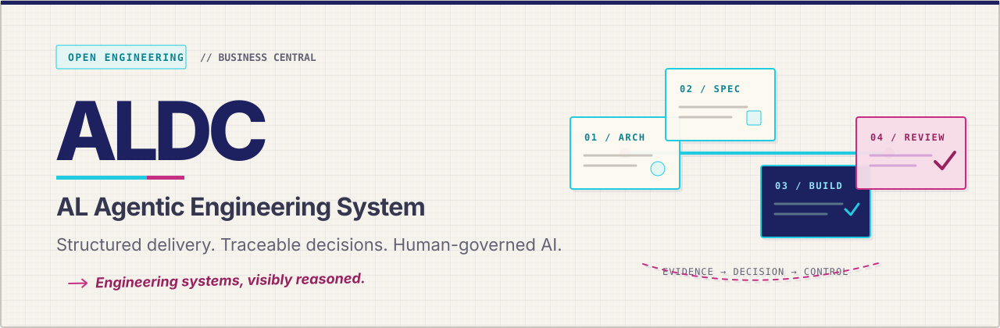
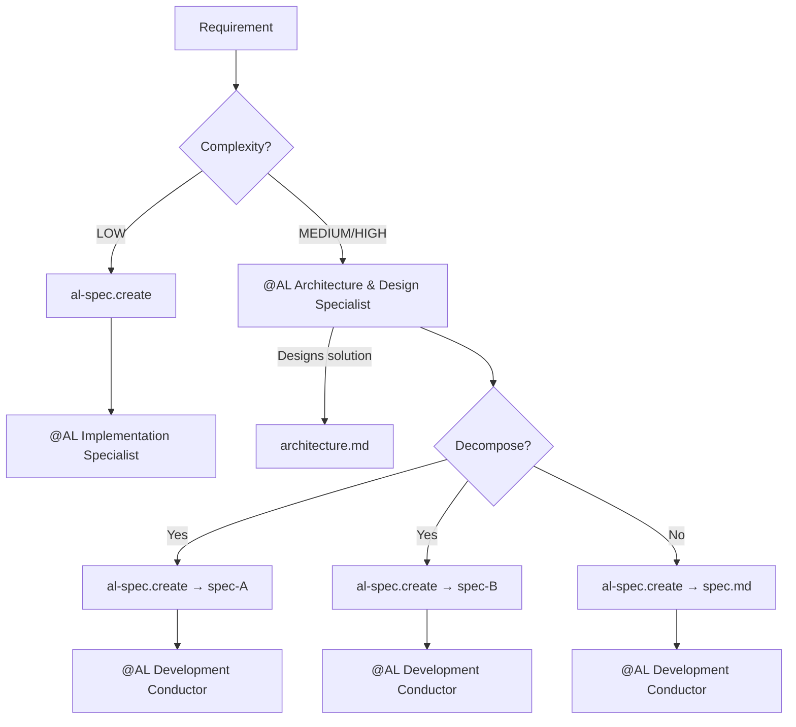
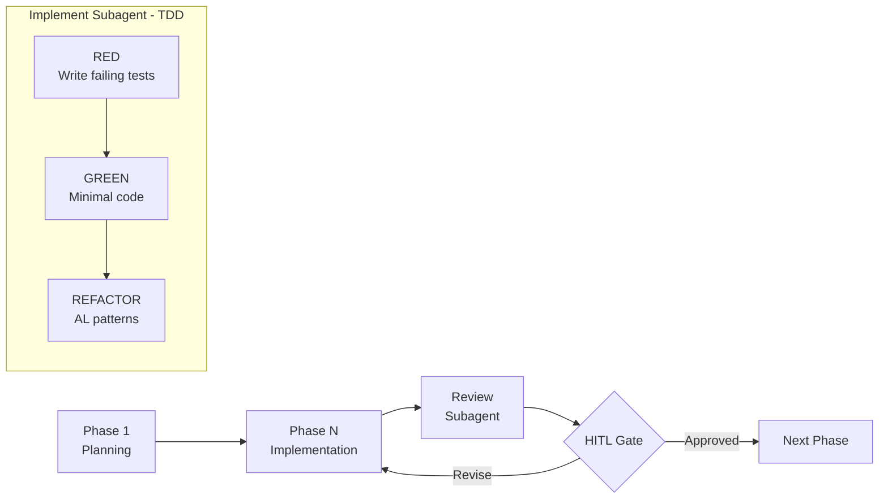
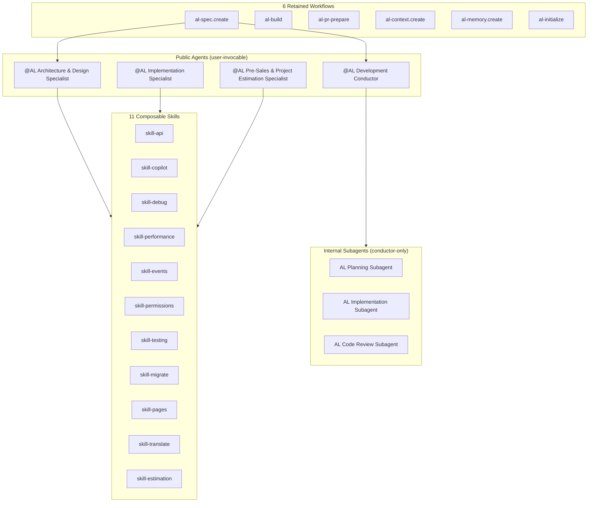

<div align="center">



# ALDC — AL Agentic Engineering System

**Skills-based, spec-driven, TDD-orchestrated development framework for Microsoft Dynamics 365 Business Central.**

_Engineering systems, visibly reasoned._

[](docs/framework/ALDC-Core-Spec-v1.2.md)
[](CHANGELOG.md)
[](claude-plugin/)
[](https://danielmeppiel.github.io/awesome-ai-native/)
[](./LICENSE)
[](https://github.com/javiarmesto/ALDC-AL-Development-Collection/issues)
[](https://github.com/javiarmesto/ALDC-AL-Development-Collection/stargazers)

</div>

ALDC combines specialist agents, reusable domain skills and human approval to
support Business Central extension development from requirements to review.

**Release status:** ALDC **5.0.1** is available in the
[GitHub release](https://github.com/javiarmesto/ALDC-AL-Development-Collection/releases/tag/v5.0.1).
GitHub releases and VS Code Marketplace publication are separate deliveries;
check the Marketplace listing for its currently published version.

**Checkout baseline:** `package.json` declares **5.0.2**. That is distinct from the published release above; it does not establish a Marketplace, npm or plugin publication at that version.

## Start here

Choose the [installation guide](https://javiarmesto.github.io/ALDC-AL-Development-Collection/start/) for your host, then follow the [Quick Start](#quick-start). Use your own AL project and BC sandbox; check its `app.json`, symbols and permissions before any build or publication. ALDC supplies development context and workflows, not a Business Central environment.

The expected first result is a validated toolkit installation and reviewed requirement artifacts in your project. Host/tool discovery does not prove an MCP invocation, successful AL compilation or a deployment. This documentation audit on **6 October 2026** did not execute those operations.

[Architecture and distribution map](ARCHITECTURE.md) · [Installation/recovery](docs/plugin-packaging.md) · [Doctor](tools/context-doctor/README.md) · [Public BC/AL/MCP repository catalogue](docs/public-repositories.md).

## What changed in 5.0.1

- **Copilot Chat models:** the Chat installer selects `Claude Sonnet 5.5 (copilot)`
  for all 12 agents and the five prompts with explicit model selections, in both
  `bc28` and `bc29-native`. The other six prompts inherit the selected agent.
  Claude Code, Copilot CLI and Codex keep their own model selections. Availability
  still depends on your Copilot account and host.
- **Chat AL tooling:** role-specific AL LSP and official AL MCP guidance, with
  query-only roles separated from implementation and dependency setup. Tool
  declarations do not install a provider or prove a successful invocation.
- **Initialize for existing projects:** a preparation-only route verifies access
  on the executing MCP connection, with bounded registration/retry when authorized;
  it does not fall through to scaffolding, restoring dependencies or building.
- **Installation and packaging:** Chat projection applies to both profiles;
  install/update/profile changes and rollback preserve existing `.vscode/mcp.json`.
  The VSIX carries the projector and its guide, with equal package versions and
  provenance from clean pinned inputs.
- **Shared fixes:** corrected the terminal symbol-server package, plugin verification
  of derived locks, and templates that previously hard-coded a surface's plans root.

Update the extension and the toolkit files in each existing project separately.
Review managed-file collisions so a preserved older agent does not silently keep
its previous model. See the [5.0.1 changelog](CHANGELOG.md) for details.

| Capability | What it provides |
| --- | --- |
| Architect and Spec Agent | Approved design, bounded Specs, explicit dependencies and joint consistency review before implementation. |
| Conductor | Planning, implementation and review coordinated through existing human gates. |
| Doctor | Read-only diagnosis of configuration and operation-specific runtime observations. |
| Recommended BCQuality | Plugin or external multiroot reviews, with discovery, loading, execution and index evidence distinguished. |
| BC28 / BC29-native | Explicit Chat profile selection with role-specific tools and AL18 guidance. |
| Host adapters | Dedicated content for Copilot Chat, Copilot CLI, Claude Code and Codex. |
| Recoverable installation | Preview, visible collisions, receipts, verification and restoration. |

See [Spec Agent](docs/spec-agent.md), [profiles](docs/native-bc29.md),
[plugins and recovery](docs/plugin-packaging.md) and [Doctor](tools/context-doctor/README.md).

---

## Why ALDC?

AI accelerates AL development — but raw code generation is unpredictable, hard to review, and easy to get wrong against Business Central's extension rules. ALDC adds the engineering discipline around it.

| Without ALDC | With ALDC |
| --- | --- |
| Ad-hoc, one-shot code generation | **Contract-driven** development (architecture → spec → human approval → test-plan → code) |
| No checkpoints — you find out at the end | **Human-in-the-loop gates** at every phase |
| Tests written last (or never) | **TDD-orchestrated** — tests FIRST, then code |
| Base-app edits sneak in | **Extension-only** by construction |
| "Looks fine to me" reviews | **Cited reviews & audits** against BC knowledge |

---

## What is ALDC?

ALDC (AL Development Collection) transforms how you develop Business Central extensions. Instead of ad-hoc code generation, it provides **structured, contract-driven development** with specialized agents, composable skills, and human-in-the-loop gates — with host-specific distributions:

- **GitHub Copilot** — Agents, skills, prompts, and instructions in `.github/` and `agents/`
- **Claude Code** — Agents, skills, rules, and hooks in `.claude/` and `claude-plugin/`
- **Copilot CLI** — Terminal agents and commands in `copilot-cli-plugin/`
- **Codex** — Generated agent profiles and a local ALDC skill in `plugins/aldc-codex/`

---

## Updating ALDC

The VS Code extension and each host plugin are separate distribution channels.
Updating the VSIX does not refresh installed Claude Code, Copilot CLI or Codex plugins.

In VS Code, open **AL Collection: Open Project Manager** (also available as a view in
the Explorer) to preview and confirm the update, verify the installation, restore the
previous transaction and run Doctor without leaving the panel; the **ALDC Visor** view
lists the plan artifacts of each requirement with template-specific icons. The palette
command **AL Collection: Update Toolkit** remains available: review file collisions,
verify the installation and reload the window. Existing installations retain their
recorded profile. The extension's optional `al-collection.autoInstall` setting is
`false` by default; when enabled, it attempts installation on AL project detection.
Toolkit restoration covers installation files, not Business Central data or all
project history. See [installation and recovery](docs/plugin-packaging.md).

## Installation

[Choose your surface — installation guide](https://javiarmesto.github.io/ALDC-AL-Development-Collection/start/) · [Guía en castellano](https://javiarmesto.github.io/ALDC-AL-Development-Collection/start-es/)


For the opt-in **BC29 / AL18 native profile in Copilot Chat**, see
[installation, role changes and local validation](docs/native-bc29.md).
BC28 remains the installer default. Claude Code and the dedicated `aldc-cli` plugin
include terminal-specific BC29/AL18 contracts; see the same guide for checkout-local
installation and pending runtime verification. The VS Code extension is published separately.

### GitHub Copilot

Install from the VS Code Marketplace or:

```bash
code --install-extension javierarmestogonzalez.al-development-collection
```

Then, from the Command Palette:

- `AL Collection: Install Toolkit to Workspace` — copies the framework into your project's `.github/`
- `AL Collection: Update Toolkit` — updates toolkit content; review collision behavior in your installed version
- `AL Collection: Validate Installation` — verifies compliance

### GitHub Copilot (Plugin Marketplace)

ALDC also ships as an installable Copilot plugin — `plugin.json` declares the agents (`agents/`), skills (`skills/`), and prompts (`prompts/`) that get installed, for editors that support the Copilot plugin marketplace:

The root plugin retains the VS Code-oriented primitives. For **Copilot CLI**, use
the dedicated terminal distribution from this checkout:

```bash
copilot plugin install ./copilot-cli-plugin
copilot plugin list
```

The catalog entry is `aldc-cli@aldc-marketplace`.
See [plugin loading checks and limitations](docs/native-bc29.md#plugins-de-claude-code-y-copilot-cli)
before testing. The directory is generated with `npm run sync:copilot-cli`.

### Claude Code (Plugin)

```bash
/plugin install aldc
/aldc:al-initialize
```

`al-initialize` copies path-scoped rules to `.claude/rules/`, generates a project `CLAUDE.md`, and configures the workspace.

### Claude Code (Direct)

Clone this repo and open it with Claude Code. The `.claude/` directory and `CLAUDE.md` are detected automatically.

---

## Quick Start

### GitHub Copilot

1. Install the extension and open your AL project
2. Run `AL Collection: Install Toolkit to Workspace`
3. Start with `@workspace use al-spec.create` plus your requirement
4. Follow the guided flow

### Claude Code

1. `/plugin install aldc`
2. `/aldc:al-initialize`
3. Call any agent: `@al-architect`, `@al-developer`, `@al-conductor`, `@al-presales`
4. Or run a workflow: `/aldc:al-spec-create`

See [QUICKSTART.md](docs/framework/QUICKSTART.md) for the full onboarding guide.

---

## Key Features

### 🤖 5 Core Agents — one specialist per development phase

| Agent | Role |
| --- | --- |
| `@AL Architecture & Design Specialist` | Designs solutions, information flows, technical decisions |
| `@AL Spec Agent` | Specifies approved designs through the shared `al-spec.create` contract |
| `@AL Implementation Specialist` | Implements, debugs, quick adjustments |
| `@AL Development Conductor` | Orchestrates TDD implementation with subagents |
| `@AL Pre-Sales & Project Estimation Specialist` | Estimation and scoping |

### 🔬 3 Internal Subagents — autonomous specialists inside the Conductor

- **AL Planning Subagent** — research and context gathering
- **AL Implementation Subagent** — TDD-only (tests FIRST, code SECOND)
- **AL Code Review Subagent** — review against spec + architecture

### 🩺 3 On-demand Specialists — user-invocable, read-only on code

- `@AL Triage` — reactive diagnosis: reproduce → root-cause → minimal-fix recommendation
- `@Dredd` — independent auditor: BCQuality-cited static audit with an advisory verdict
- `@AL Developer Reviewer` — independent review of direct Developer increments

### 🧠 Core domain skills — knowledge loaded on demand

- **Required:** api · copilot · debug · performance · events · permissions · testing
- **Recommended:** migrate · pages · translate · estimation
- The complete source has 16 skill directories, including contribution assistance, BC Agent modules and the shared AL review pipeline. See [skills/](skills/). Host distributions also package role entries and workflows; their folder counts measure a different scope.

### ⚙️ 6 Workflows — automated processes

`al-spec.create` · `al-build` · `al-pr-prepare` · `al-context.create` · `al-memory.create` · `al-initialize`

### 📐 Scoped instructions and the Copilot entrypoint

Eight `*.instructions.md` files apply by their declared globs, including the optional BC Agent toolkit rule. `copilot-instructions.md` is the always-on entrypoint and `index.md` is documentation; neither is an additional scoped rule. See [instructions/](instructions/).

### 📚 BCQuality (recommended) — external, citable BC knowledge layer

Optional cited review through an explicitly selected host plugin or external multiroot knowledge base. Agents distinguish discovery, loading, execution and best-effort index generation; unavailable providers retain native A–G coverage. See [`docs/bcquality.md`](docs/bcquality.md).

### 📄 Contracts per Requirement — structured docs in `.github/plans/{req_name}/`

- `{req_name}.architecture.md` — solution design (from architect)
- `{req_name}.spec.md` — technical blueprint (from spec.create)
- `{req_name}.test-plan.md` — test strategy
- `memory.md` — global context across sessions

---

## How It Works

### Development Flow

```text
LOW complexity:
  al-spec.create → @AL Implementation Specialist

MEDIUM/HIGH complexity:
  @AL Architecture & Design Specialist → al-spec.create → @AL Development Conductor
```

The architect designs the solution and can decompose complex requirements into multiple specs, each implemented independently by the conductor.


```mermaid
flowchart TD
    REQ[Requirement] --> CLASSIFY{Complexity?}
    CLASSIFY -->|LOW| SPEC_LOW[al-spec.create]
    SPEC_LOW --> DEV["@AL Implementation Specialist"]

    CLASSIFY -->|MEDIUM/HIGH| ARCH["@AL Architecture & Design Specialist"]
    ARCH -->|Designs solution| ARCH_DOC[architecture.md]
    ARCH --> DECOMPOSE{Decompose?}
    DECOMPOSE -->|Yes| SPEC_A[al-spec.create → spec-A]
    DECOMPOSE -->|Yes| SPEC_B[al-spec.create → spec-B]
    DECOMPOSE -->|No| SPEC_SINGLE[al-spec.create → spec.md]
    SPEC_A --> COND_A["@AL Development Conductor"]
    SPEC_B --> COND_B["@AL Development Conductor"]
    SPEC_SINGLE --> COND["@AL Development Conductor"]
```

### TDD Orchestration

The conductor enforces Test-Driven Development:


```mermaid
flowchart LR
    PLAN[Phase 1\nPlanning] --> IMPL[Phase N\nImplementation]
    IMPL --> REVIEW[Review\nSubagent]
    REVIEW --> HITL{HITL Gate}
    HITL -->|Approved| NEXT[Next Phase]
    HITL -->|Revise| IMPL

    subgraph IMPL_DETAIL[Implement Subagent - TDD]
        RED[RED\nWrite failing tests] --> GREEN[GREEN\nMinimal code]
        GREEN --> REFACTOR[REFACTOR\nAL patterns]
    end
```

1. Planning subagent researches context
2. Implement subagent creates tests FIRST (RED)
3. Implement subagent writes code to pass tests (GREEN)
4. Implement subagent refactors to AL patterns (REFACTOR)
5. Review subagent validates against spec + architecture
6. Human approves each phase (HITL gate)

### Framework Architecture


```mermaid
graph TB
    subgraph PUBLIC["Public Agents (user-invocable)"]
        ARCH["@AL Architecture & Design Specialist"]
        DEV["@AL Implementation Specialist"]
        COND["@AL Development Conductor"]
        PRE["@AL Pre-Sales & Project Estimation Specialist"]
    end

    subgraph INTERNAL["Internal Subagents (conductor-only)"]
        PLAN[AL Planning Subagent]
        IMPL[AL Implementation Subagent]
        REV[AL Code Review Subagent]
    end

    subgraph SKILLS["11 Composable Skills"]
        S1[skill-api]
        S2[skill-copilot]
        S3[skill-debug]
        S4[skill-performance]
        S5[skill-events]
        S6[skill-permissions]
        S7[skill-testing]
        S8[skill-migrate]
        S9[skill-pages]
        S10[skill-translate]
        S11[skill-estimation]
    end

    subgraph WORKFLOWS["6 Retained Workflows"]
        W1[al-spec.create]
        W2[al-build]
        W3[al-pr-prepare]
        W4[al-context.create]
        W5[al-memory.create]
        W6[al-initialize]
    end

    ARCH --> SKILLS
    DEV --> SKILLS
    COND --> INTERNAL
    PRE --> SKILLS

    W1 --> ARCH
    W1 --> COND
```

### Contract Structure

```text
.github/
└── plans/
    ├── memory.md                          ← Global (cross-session context)
    └── {req_name}/
        ├── {req_name}.architecture.md    ← From @AL Architecture & Design Specialist
        ├── {req_name}.spec.md            ← From al-spec.create
        ├── {req_name}.test-plan.md       ← From al-spec.create or conductor
        ├── {req_name}-plan.md            ← From @AL Development Conductor (Planning)
        ├── {req_name}-phase-1-complete.md
        └── {req_name}-phase-N-complete.md
```

---

## Routing Guide

| Complexity | Route | When |
| ---------- | ----- | ---- |
| **LOW** | `al-spec.create` → `@AL Implementation Specialist` | Simple field, validation, single UI change |
| **MEDIUM** | `@AL Architecture & Design Specialist` → `al-spec.create` → `@AL Development Conductor` | Business logic, event-driven feature |
| **HIGH** | `@AL Architecture & Design Specialist` → `al-spec.create` → `@AL Development Conductor` | Multi-module, external integration, architectural change |

**Not sure where to start?**

```text
@AL Architecture & Design Specialist

I need to [describe your requirement]
```

The architect analyzes requirements, designs the solution, and recommends the appropriate workflow.

---

## ALDC for Claude Code

ALDC is available as a native **Claude Code** integration in two forms:

- **Official Plugin** (`claude-plugin/`) — Install with `/plugin install aldc`, namespaced as `aldc:*`
- **Direct Integration** (`.claude/`) — Auto-detected when opening the repo in Claude Code

### What's Included

| Primitive | Direct (`.claude/`) | Plugin (`aldc:`) | Count |
| --------- | ------------------- | ---------------- | ----- |
| Agents | `.claude/agents/` | `agents/` | 9 public + 3 internal |
| Skills | `.claude/skills/` | `skills/` | 16 knowledge modules + 9 role entries + 11 workflows |
| Rules | `.claude/rules/` | `rules/` (injected via `al-initialize`) | 8 coding standards |
| MCP Servers | `.mcp.json` | `.mcp.json` | 3 servers |
| Hooks | `.claude/settings.json` | `hooks/hooks.json` | 2 hooks |
| Instructions | `CLAUDE.md` | `CLAUDE.md` | Agent routing, workflows |

### How It Maps

```text
GitHub Copilot              →  Claude Code (Direct)         →  Claude Code (Plugin)
──────────────────────────────────────────────────────────────────────────────────────
agents/*.agent.md           →  .claude/agents/*.md          →  agents/*.md
skills/*/SKILL.md           →  .claude/skills/*/SKILL.md    →  skills/*/SKILL.md
instructions/*.md           →  .claude/rules/*.md           →  rules/*.md
prompts/*.prompt.md         →  .claude/skills/ (workflows)  →  skills/ (workflows)
.github/copilot-instructions.md → CLAUDE.md                 →  plugin.json + CLAUDE.md
```

### Agent Routing (Claude Code)

| Agent | Direct | Plugin |
| ----- | ------ | ------ |
| Architecture & Design | `@al-architect` | `@aldc:al-architect` |
| Technical Specification | `@al-spec-agent` | `@aldc:al-spec-agent` |
| Implementation | `@al-developer` | `@aldc:al-developer` |
| TDD Orchestration | `@al-conductor` | `@aldc:al-conductor` |
| Estimation & Scoping | `@al-presales` | `@aldc:al-presales` |
| Agent Builder | `@al-agent-builder` | `@aldc:al-agent-builder` |

### Workflows (Claude Code)

| Workflow | Direct | Plugin |
| -------- | ------ | ------ |
| Create specifications | `/al-spec-create` | `/aldc:al-spec-create` |
| Build & deploy | `/al-build` | `/aldc:al-build` |
| Prepare PR | `/al-pr-prepare` | `/aldc:al-pr-prepare` |
| Session memory | `/al-memory-create` | `/aldc:al-memory-create` |
| Project context | `/al-context-create` | `/aldc:al-context-create` |
| Environment setup | `/al-initialize` | `/aldc:al-initialize` |

### Hooks

Claude Code hooks enforce quality gates automatically:

- **PostToolUse** (Write/Edit) — Reminds to run tests after file modifications
- **Stop** — Reminds to verify Skills Evidencing was declared

### Plugin User Configuration

On first enable, the plugin prompts for optional settings:

| Setting | Description |
| ------- | ----------- |
| `bcSandboxUrl` | URL of your Business Central sandbox environment |
| `publisherName` | Your extension publisher name for app.json |

---

## Using BCQuality (recommended)

BCQuality supports explicit `plugin` and `external-multiroot` modes in `aldc.yaml`.
Plugin mode loads the configured skill (default `al-code-review`); multiroot
retains the external Entry workflow. An expected version or commit is not proof of
the installed identity, and catalog discovery is not execution. When unavailable,
native review continues. See [configuration and evidence](docs/bcquality.md).

## BC Agent Builder (optional)

Build Business Central Agents with the AI Development Toolkit and Agent SDK.
Includes: `@AL Agent Builder` agent, 3 skills, 4 workflows, validation tools.
See [BC Agent Builder documentation](docs/bc-agent-builder.md).

---

## Validation

```bash
node tools/aldc-validate/index.js --config aldc.yaml
```

Expected result: `✅ ALDC Core v1.2 COMPLIANT`

---

## File Structure

```text
AL-Development-Collection-for-GitHub-Copilot/
│
│── GitHub Copilot ─────────────────────────────────────
├── .github/
│   ├── copilot-instructions.md           # Master coordination
│   └── plans/                            # Per-requirement contracts
│       ├── memory.md                     # Global memory (cross-session)
│       └── {req_name}/
│           ├── {req_name}.architecture.md
│           ├── {req_name}.spec.md
│           └── {req_name}.test-plan.md
├── agents/                               # 12 agents (5 core + 3 on-demand + 3 subagents + 1 extension)
├── skills/                               # 16 composable skill directories
├── prompts/                              # 6 retained workflows
├── instructions/                         # 8 scoped rules + entrypoint and documentation
│
│── Claude Code (Direct) ───────────────────────────────
├── CLAUDE.md                             # Master instructions
├── .mcp.json                             # MCP server configuration
├── .claude/
│   ├── agents/                           # 12 agents (9 public + 3 internal)
│   ├── skills/                           # 16 skills (composable knowledge modules)
│   ├── rules/                            # 8 path-scoped coding standards
│   └── settings.json                     # Hooks + permissions
│
│── Claude Code Plugin ─────────────────────────────────
├── claude-plugin/                        # generado: scripts/sync-plugin-support.js
│   ├── .claude-plugin/plugin.json        # Plugin manifest
│   ├── agents/                           # 12 agents (auto-discovered)
│   ├── skills/                           # 9 role entries + 11 workflows + 16 knowledge
│   ├── hooks/hooks.json                  # PostToolUse + Stop hooks
│   ├── rules/                            # 8 rules (injected via al-initialize)
│   ├── .mcp.json                         # 3 MCP servers
│   └── README.md                         # Plugin documentation
│
│── Shared ─────────────────────────────────────────────
├── docs/
│   ├── framework/                        # Normative spec + diagrams
│   └── templates/                        # Immutable contract templates (7)
├── tools/aldc-validate/                  # ALDC Core validator
├── aldc.yaml                             # Core v1.2 configuration
├── CHANGELOG.md                          # Version history
└── README.md                             # This file
```

---

## Reference

### Framework Documentation

- [Core Specification v1.2](docs/framework/ALDC-Core-Spec-v1.2.md)
- [Architecture Diagrams](docs/framework/ALDC-Architecture-Diagrams.md)
- [Manifesto](docs/framework/ALDC-Manifesto.md)
- [Quickstart](docs/framework/QUICKSTART.md)
- [Governance](docs/framework/ALDC-Governance.md)
- [Compliance Model](docs/framework/ALDC-Compliance-Model.md)
- [Migration Guide v1.0→v1.1](docs/framework/ALDC-Migration-v1.0-to-v1.1.md)

### MCP Servers Integration

| Server | Purpose |
| ------ | ------- |
| [al-symbols-mcp](https://github.com/StefanMaron/AL-Dependency-MCP-Server) | AL object analysis from compiled .app packages |
| [context7](https://github.com/upstash/context7) | Up-to-date library documentation retrieval |
| [microsoft-docs](https://learn.microsoft.com/training/support/mcp) | Official Microsoft/Azure documentation search |

### Requirements

**GitHub Copilot**
- Visual Studio Code 1.85.0+
- GitHub Copilot (agent and skill features)
- AL Language Extension
- Node.js 20+ (for validator)

**Claude Code**
- Claude Code CLI v1.0.33+
- AL Language Extension
- Node.js 20+ (for MCP servers via npx)

---

## What's New

### 5.0.0 — one delivery across every surface

Dedicated Spec Agent, per-operation Doctor, BC29-native tooling, terminal adapters
and recoverable initialization, plus the VS Code Project Manager and Visor, BCQuality
read as context in the design phases, and a Claude Code plugin that is generated
rather than hand-written. It supersedes the unreleased 4.3.0 and 4.3.1, neither of
which was ever tagged or published. Major for the plugin layout and the per-surface
plans and audits roots; see the [5.0.0 changelog](CHANGELOG.md).


### 4.2.0 — Conformance release

The framework now enforces its own spec in CI.

- **Core Spec v1.2 (original 4.2.0 release)** — originally normalized the tier model to 4 core agents + 2 on-demand (`al-triage`, `dredd`) + 3 subagents + 1 extension (`al-agent-builder`); 16 skills; 11 workflows. The subsequent canonical Spec Agent increment adds a fifth core role (11 total); Developer Reviewer adds a direct review role (12 total, with a shared review pipeline).
- **Conformance tooling** — `scripts/check-conformance.js` (counters, cross-references, links, frontmatter) and `scripts/sync-foundation.js --check` (zero drift between the canonical trees and `packages/foundation/`) run on every push and PR.
- **`ARCHITECTURE.md`** — one-page map of what is source, what is generated, and which distribution channel consumes each tree.
- Fixed: truncated `skill-manifest` in `packages/foundation/`, broken README links, undeclared primitives in `aldc.yaml`, contradictory counters.

### 4.1.0 — Lower token cost & cited audits

- **⚡ Lower token / AIC cost** — trimmed always-on entrypoint (~31% lighter), narrow instruction globs (`applyTo` by object type), curated context passing, condensed primitives, BCQuality task-context built once and passed inline.
- **📚 Cited reviews & audits with BCQuality (recommended)** — agents back findings with a pinned BC knowledge base; graceful native fallback (never blocks).
- **`@AL Triage`** and **`@Dredd`** — read-only on-demand specialists.
- **`skill-contribution-assistant`** — guided contribution workflow.
- Restored full architecture & spec templates with authoring guidance.

### 4.0.0 — Token efficiency & foundation layout

- Agents, instructions, skills, prompts, and templates condensed for a lower token footprint — behavior preserved.
- New `packages/foundation/` layout; Architecture Decision Records (`docs/decisions/`); new `al-agent.build-instructions` prompt; English-only content.
- **Breaking:** primitives also available under `packages/foundation/`; agent/instruction/skill wording token-optimized (behavior unchanged).

See [CHANGELOG.md](CHANGELOG.md) for full details.

---

## Author

**Javier Armesto González**
Microsoft MVP (Business Central & Azure AI Services)
Head of R&D & AI at VS Sistemas
[LinkedIn](https://www.linkedin.com/in/jarmesto/) · [Tech Sphere Dynamics](https://techspheredynamics.com)

---

## Support & Contributing

- Report issues: [GitHub Issues](https://github.com/javiarmesto/ALDC-AL-Development-Collection/issues)
- Ask questions: [GitHub Discussions](https://github.com/javiarmesto/ALDC-AL-Development-Collection/discussions)
- See [CONTRIBUTING.md](CONTRIBUTING.md) for contribution guidelines

---

## License

MIT — See [LICENSE](LICENSE) for details.

<div align="center">

**Status:** ALDC Core v1.2 COMPLIANT · **Distributions:** Copilot Chat / CLI, Claude Code, Codex · **Checkout package version:** 5.0.2

</div>

### Independent review

Use **Developer Reviewer** after a direct Developer increment; use the Conductor's
review subagent for orchestrated phases. **Dredd** remains the independent advisory
auditor for an explicit file set, changes or a broader codebase. All three share
provider execution and coverage rules: loading BCQuality is not execution, and
skipping its optional index refresh does not stop path-based review. A partial
review never becomes approval from zero findings. See
[the review contract](docs/templates/review-report-contract.md).
