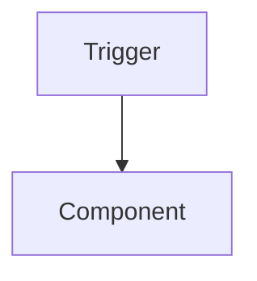

<!-- ALDC Core Template — IMMUTABLE. Do NOT edit this file directly.
     Copy to .github/plans/{req_name}/{req_name}.architecture.md and fill in. -->

# Architecture: {Feature Name}

**Date**: YYYY-MM-DD
**Revision**: {revision; retain references to actual approval}
**Complexity**: [LOW / MEDIUM / HIGH]
**Author**: al-architect
**Status**: [Proposed / Approved / Implemented / Superseded]

> **Skills applied**: {list skills loaded during design — e.g. `skill-api, skill-events, skill-performance` — or write "None (general architecture patterns only)"}
> *(List only skills actually loaded. The Conductor and Review Subagent use this for downstream traceability.)*

---

## 1. Executive Summary

{2-3 sentence overview describing what the feature is, what it solves and the high-level approach.}

## 2. Business Context

### Problem Statement

{Describe the pain point or unmet need that justifies this work.}

### Success Criteria

| ID | Criterion | Observable |
|----|-----------|------------|
| AC-01 | {Outcome the business expects} | {How we will verify it} |

## 3. Solution Architecture

{Explain the chosen pattern (event-driven extension, stored fields vs FlowFields, etc.) and *why*. Include 1-3 Mermaid diagrams showing data flow, process flow and/or object relationships. Diagrams must add information that prose cannot — do not duplicate the diagram in a table.}

## 4. Data Model

{Tables, table extensions, enums — high level with relationships. Include an ER diagram if the relationships are non-trivial.}

| Object | Type | Purpose | Notes |
|--------|------|---------|-------|

## 5. Business Logic

{Codeunits, their responsibilities, event architecture. List public procedures with signatures.}

| Procedure | Visibility | Responsibility |
|-----------|-----------|----------------|

## 6. User Interface

{Pages, page extensions, factboxes, reports. Describe layout decisions and the rationale.}

## 7. Integration Points

{Events subscribed (inbound), events published (outbound), APIs, external systems. Indicate whether each is an existing BC event or a new integration event introduced by this feature.}

## 8. Security Model

{Permission sets, data classification, multi-company considerations.}

| Object | DataClassification | Permission |
|--------|-------------------|------------|

## 9. Performance Considerations

{Identify hotspots, table volume estimates, query strategy (set-based vs iterative), indexing needs, batch processing. Reference `al-performance.instructions.md` and `skill-performance` for execution patterns.}

## 10. Technical Decisions

{Minimum 3 decisions. For each, document the problem, the chosen option, alternatives rejected and the rationale. This section is what makes the document auditable months later.}

### TD-01: {Decision Title}

- **Problem**: {What had to be decided}
- **Decision**: {Chosen approach}
- **Alternatives rejected**: {What else was considered}
- **Rationale**: {Why this is the right call here}

## 11. Implementation Phases

{Ordered list of phases with dependencies and exit criteria. Each phase must be self-contained.}

### Phase 1 — {Title}

| ID | Object | Type |
|----|--------|------|

**Prerequisite for**: {next phases}
**Exit criterion**: {observable definition of done}

## 12. Risks & Mitigations

{Minimum 3 risks. Include likelihood, impact and explicit mitigation.}

| ID | Risk | Likelihood | Impact | Mitigation |
|----|------|-----------|--------|------------|

## 13. Deployment Plan

### Pre-deploy

- [ ] {Check}

### Post-deploy

- [ ] {Check}

### Rollback

{What happens on uninstall, data migration considerations, idempotency.}

## 14. Spec Decomposition

For MEDIUM/HIGH, explicitly choose `single-spec` or `multi-spec` and explain why.
One cohesive, reviewable capability may stay single-spec. Split by independently
reviewable capabilities or real contract boundaries, not merely tables/codeunits/pages.
Legacy approved architectures without this table keep their approved scope/order;
do not invent parallel eligibility or rename existing spec files on upgrade.

### Units and ownership

Use one row per unit, stable SPEC-IDs and unique repository-relative output paths.
Keep single-spec at `.github/plans/{req_name}/{req_name}.spec.md`. Multi-spec files
share that same requirement directory, e.g.
`.github/plans/{req_name}/{req_name}.spec-01-policy.spec.md`. Preserve existing
assigned paths on revision; no extra /specs directory or JSON companion artifacts.

| Spec ID / name | Objective and acceptance | Scope in / out | Output .spec.md | Architecture decisions / proof obligations | Contracts provided / consumed |
| --- | --- | --- | --- | --- | --- |
| SPEC-01 / {capability} | {bounded outcome} | {ownership and exclusions} | {unique path} | {decision references} | {contract references} |

### Dependencies and stable shared contracts

| Consumer | Dependency type | Predecessor | Concrete result consumed / why needed first | Required revision and approval / current availability |
| --- | --- | --- | --- | --- |
| {SPEC-ID} | {generation_depends_on / implementation_depends_on} | {SPEC-ID} | {named contract or implemented capability} | {reference or pending} |

- `generation_depends_on`: another spec must first resolve a technical contract
  that this unit needs for authoring. Wait for the required completed, human-approved
  predecessor contract. Partial research may continue; do not finalize the dependent
  spec or call it ready while that prerequisite is absent, changed or unapproved.
- `implementation_depends_on`: authoring may proceed from stable approved contracts,
  but implementation must respect the predecessor result. Do not block specification
  merely because the predecessor's AL code does not yet exist.
- For each dependency name the concrete result consumed. Similar subject matter,
  preferred order or a shared file alone is not a dependency. State `None` explicitly
  when there is no dependency; do not leave the distinction ambiguous.
- Record shared interfaces/data shape, owner, constraints and approved revision
  in this architecture (or a precise approved predecessor-contract reference).
  Where relevant include project/app identity, object/field IDs and types, default,
  errors and consumers. Unknown details needed by another unit are real generation
  prerequisites, not permission for concurrent authors to invent different contracts.

### Shared resources and authoring groups

| Resource | Affected units | Owner / non-overlapping allocation | Coordination / unresolved conflict |
| --- | --- | --- | --- |
| {App/Test object IDs, file, manifest or shared contract} | {SPEC-IDs} | {checked allocation or gap} | {plan; Spec never writes the shared resource} |

Architecture owns agreed allocations. Check project + app identity where needed +
object type + ID, field IDs within their table, and output paths for collisions.
Specs describe resource needs in their own files; they never reserve resources by
editing app.json, shared architecture/memory or siblings. An unexpected collision
returns to Architect for coordination; it does not create a false dependency.

| Authoring group | Spec IDs | Required predecessor contracts | Parallel eligibility and reason / unresolved issue |
| --- | --- | --- | --- |
| {G1} | {units} | {approved revisions or None} | {eligible / blocked; explanation} |

Before presenting the decomposition for human approval, Architect checks unique
IDs/paths, declared dependency references, no self-dependencies or cycles in either
dependency type, and exactly one group assignment per unit. Generation predecessors
must be in earlier groups. Derive groups from generation dependencies; separately
resolve concrete resource conflicts and identify stable shared contracts. An
implementation edge alone never serializes authoring. No safe group means explain
what is missing; do not assert parallel safety from a diagram or file count.

Eligibility is a justified authoring decision, not observed concurrent execution
or authorization for parallel implementation. Separate Spec sessions may run only
within the approved assignment and actual host capabilities/session authorization.
Sequential execution of eligible units remains valid when delegation is unavailable;
record that parallel execution was not tested. Do not create a scheduler, DAG runtime,
Evidence Store, Context Envelope or transition state system.

### Joint consistency review and corrections

After the required specs return, Architect reads their actual current revisions
and compares ownership, shared contracts, IDs/paths, both dependency types and
cross-spec acceptance. Record the result here; do not rewrite sibling specs.

| Spec / reviewed revision | Shared contracts and dependencies checked | Finding / affected consumers | Resolution / re-review needed |
| --- | --- | --- | --- |
| {SPEC-ID / revision} | {references} | {consistent or precise conflict} | {owner and next action} |

Technical consistency review does not approve specs. Human approval must identify
the specific reviewed spec revisions; one approved unit never approves its siblings.
Before handing a selected implementation increment to Conductor, include its approved
specs, current consistency result and implementation prerequisites; do not claim the
whole requirement ready while required units are pending. Conductor's existing
planning and approval gates remain unchanged.

A changed shared contract reopens only affected consumers and their consistency/
approval status. Preserve unrelated approved work; do not reuse an old joint review
for revised specs. Architect owns boundary/dependency/allocation decisions; Spec owns
ordinary technical research. Resume by reading the current architecture, assigned
spec and required contract revisions, never from an obsolete chat summary alone.

---

## Rules

- All 14 sections above are **required** for MEDIUM/HIGH complexity. For LOW complexity, sections 11-14 may be condensed into a single "Plan" paragraph.
- Update the **Status** field as the document evolves: `Proposed` → `Approved` → `Implemented` → `Superseded` (if replaced).
- The `> Skills applied:` line at the top is **mandatory** even when no skill was loaded (write "None" then).
- Do not duplicate content across sections — cross-reference instead.
- Mermaid diagrams must add information that prose cannot.
- Do not include AL code blocks in this document — describe behaviour and link to the future `.spec.md` or to existing files.
