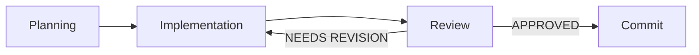

# :material-music-clef-treble: AL Development Conductor

<div class="agent-card" markdown>

| | |
|---|---|
| **Agent ID** | `al-conductor` |
| **Model** | Claude Haiku 4.5 |
| **Type** | User-facing · Orchestrator |
| **Invocation** | `@AL Development Conductor` |

</div>

---

## Purpose

Orchestrates the full **Planning → Implementation → Review → Commit** cycle for Business Central AL extensions. Coordinates three specialized subagents to deliver high-quality code following Test-Driven Development.

## When to use

- MEDIUM / HIGH complexity features requiring structured TDD
- Multi-phase implementations (3+ AL objects with tests)
- Need enforced quality gates and code reviews
- Want a documentation trail for complex features

## Orchestration cycle



## Subagents

| Subagent | Role | Model |
|---|---|---|
| **AL Planning Subagent** | Research codebase, gather context, identify objects | Claude Sonnet 4.5 |
| **AL Implementation Subagent** | RED → GREEN → REFACTOR TDD cycle | Claude Sonnet 4.5 |
| **AL Code Review Subagent** | Quality assurance, pattern validation, verdict | Claude Sonnet 4.5 |

## Input options

| Input | Benefit |
|---|---|
| `architecture.md` + `spec.md` | Best path — structured implementation following strategic design |
| `spec.md` only | Clear blueprint, reduced ambiguity |
| Requirements only | Fastest start, but may need architectural adjustments |

## Outputs

- `{req_name}-phase-<N>-complete.md` — Phase completion reports
- `{req_name}-complete.md` — Final completion report
- Skills utilization summary

## Handoffs

| Destination | When |
|---|---|
| **AL Architecture & Design Specialist** | Complex feature needs architecture first |
| **AL Implementation Specialist** | Quick adjustments after orchestration completes |

## Recommended routing

```
LOW  → al-spec.create → al-developer (skip conductor)
MED  → al-architect → al-spec.create → al-conductor
HIGH → al-architect → al-spec.create → al-conductor
```

---

<small>Source: [`agents/al-conductor.agent.md`](https://github.com/javiarmesto/ALDC-AL-Development-Collection/blob/main/agents/al-conductor.agent.md)</small>