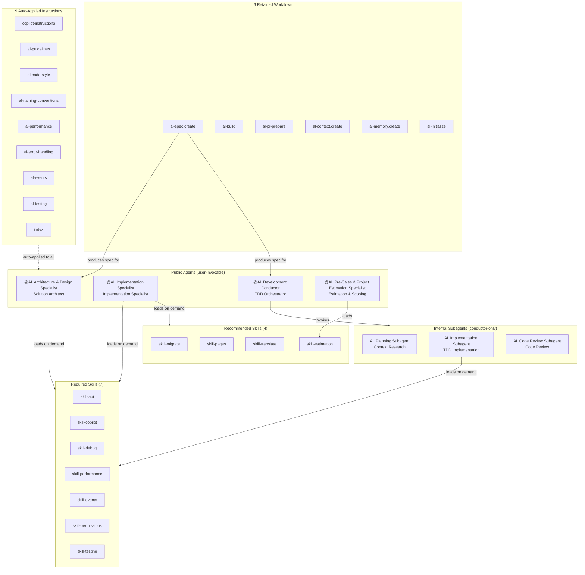
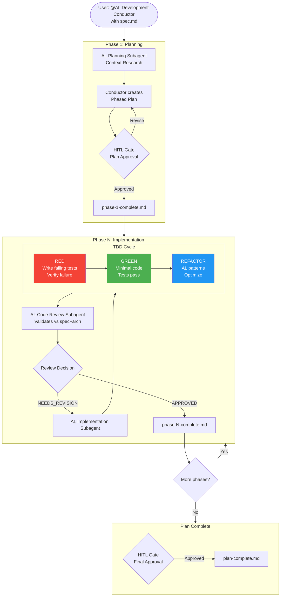
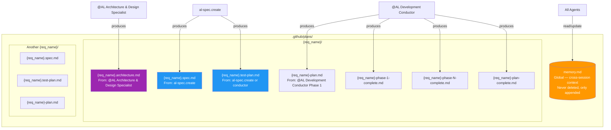

# ALDC Architecture Diagrams

Visual reference for ALDC Core v1.1 structure and flows.

---

## Diagram 1 — Framework Architecture

The full ALDC Core v1.1 component map: 4 public agents, 3 internal subagents, 11 composable skills, 6 workflows.



---

## Diagram 2 — Development Flow by Complexity

```mermaid
flowchart TD
    REQ[Requirement] --> CLASSIFY{Complexity?}

    CLASSIFY -->|LOW| SPEC_LOW[al-spec.create]
    SPEC_LOW --> DEV[@AL Implementation Specialist\nDirect Implementation]

    CLASSIFY -->|MEDIUM/HIGH| ARCH[@AL Architecture & Design Specialist\nSolution Architect]
    ARCH -->|Produces architecture.md| ARCH_DOC[(architecture.md)]
    ARCH --> DECOMPOSE{Decompose\ninto sub-requirements?}

    DECOMPOSE -->|Yes| SPEC_A[al-spec.create\n→ spec-A.md]
    DECOMPOSE -->|Yes| SPEC_B[al-spec.create\n→ spec-B.md]
    DECOMPOSE -->|No| SPEC_SINGLE[al-spec.create\n→ spec.md]

    SPEC_A --> COND_A[@AL Development Conductor\nTDD Orchestration A]
    SPEC_B --> COND_B[@AL Development Conductor\nTDD Orchestration B]
    SPEC_SINGLE --> COND[@AL Development Conductor\nTDD Orchestration]

    COND_A --> DONE_A[Delivery A]
    COND_B --> DONE_B[Delivery B]
    COND --> DONE[Delivery]
    DEV --> DONE_LOW[Delivery]

    style ARCH fill:#9C27B0,color:#fff
    style DEV fill:#2196F3,color:#fff
    style COND fill:#FF9800,color:#fff
    style COND_A fill:#FF9800,color:#fff
    style COND_B fill:#FF9800,color:#fff
```

---

## Diagram 3 — TDD Orchestration Cycle (Conductor)



---

## Diagram 4 — Contract Structure per Requirement



---

*ALDC Core v1.1 — Updated 2026-03-04*
