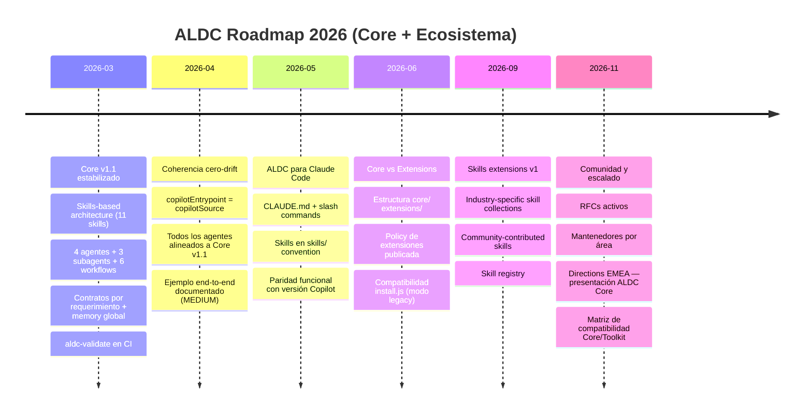

# Roadmap público 2026 (ALDC)

## Hitos clave

| Fecha | Hito | Estado |
|---|---|---|
| 2026-02 | Core v1.0 definido | ✅ Completado |
| 2026-03 | Core v1.1 (skills-based modularization with preserved orchestration) | ✅ Completado |
| 2026-03 | Migración v2.11.0 → v1.1 ejecutada | ✅ Completado |
| 2026-04 | Zero-drift + ejemplo E2E | 🔲 Pendiente |
| 2026-05 | Claude Code adaptation | 🔲 Pendiente |
| 2026-06 | Core/Extensions split | 🔲 Pendiente |
| 2026-09 | Skills packs v1 | 🔲 Pendiente |
| 2026-11 | Directions EMEA presentation | 🔲 Pendiente |
