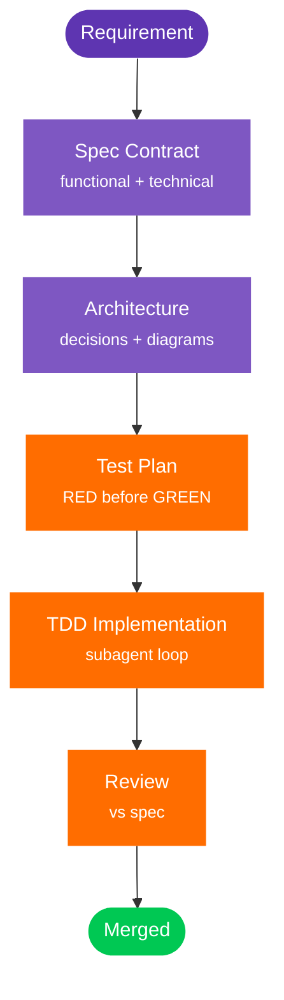

---
hide:
  - navigation
  - toc
---

# ALDC

<div class="hero">

<div class="hero-eyebrow">AL Development Collection · Spec-driven AI for Business Central</div>

<h2 class="hero-title">Ship Business Central extensions with AI agents that follow your process.</h2>

<p class="hero-tagline">ALDC gives Copilot and Claude Code a working model for AL delivery: specs, plans, tests, review gates and reusable skills. Less vibe coding. More traceable implementation.</p>

<div class="hero-actions">
  <a class="md-button md-button--primary" href="getting-started/">Start with the docs</a>
  <a class="md-button" href="al-development/">Open the collection guide</a>
  <a class="md-button" href="https://github.com/javiarmesto/ALDC-AL-Development-Collection">GitHub</a>
</div>

<div class="hero-pills">
  <span class="pill"><b>4</b> agents</span>
  <span class="pill"><b>11</b> skills</span>
  <span class="pill"><b>6</b> workflows</span>
  <span class="pill pill--accent">MIT</span>
  <span class="pill pill--accent">Copilot + Claude Code</span>
</div>

</div>

---

## What's ALDC { #whats-aldc .section-title }

<div class="two-col">
<div class="two-col-text">

<p>Most AI coding tools generate a file and hope for the best. <strong>ALDC is different.</strong></p>

<p>Every feature starts with a <strong>spec contract</strong> that is functional, technical, and testable, kept in <code>.github/plans/{req_name}/</code>. Architecture and test plans live next to it.</p>

<p>A <strong>conductor agent</strong> orchestrates a TDD cycle: the Implementation Subagent writes tests first, code second, then refactors. A Review Subagent validates against the spec. You approve every phase.</p>

<p>Underneath it all, <strong>11 composable skills</strong> covering API, events, performance, testing, and more load on demand so agents only know what they need for the task in front of them.</p>

<p>The result: AL code that passes review the first time, with traceable decisions from requirement to merge.</p>

</div>
<div class="two-col-visual" markdown="1">



</div>
</div>

---

## Why it matters { .section-title }

<div class="grid cards" markdown="1">

-   :material-file-document-check-outline: &nbsp; **Spec-driven, not prompt-and-pray**

    ---

    No more "please re-explain the requirement for the 5th time".
    Every feature has a written contract that agents consult.

-   :material-test-tube: &nbsp; **TDD enforced, not suggested**

    ---

    The Implementation Subagent refuses to write code before tests.
    RED → GREEN → REFACTOR is hardcoded in the agent.

-   :material-account-check-outline: &nbsp; **You approve every phase**

    ---

    Agents stop at architecture, plan, implementation, review, deploy.
    Nothing ships without a human saying yes.

-   :material-shield-lock-outline: &nbsp; **Extension-only discipline**

    ---

    Never touches base app objects. Always tableextensions, pageextensions,
    event subscribers. Least-privilege permissions by default.

-   :material-compare-horizontal: &nbsp; **One toolkit, two runtimes**

    ---

    Same primitives work in **GitHub Copilot** and **Claude Code**.
    Pick the tool your team already uses.

-   :material-puzzle-outline: &nbsp; **Skills load on demand**

    ---

    11 composable skills replace 300kb of prompt soup.
    Agents only load what's relevant to the task.

</div>

---

## Quick start { .section-title }

=== ":fontawesome-brands-github: GitHub Copilot (VS Code)"

    ```bash
    git clone https://github.com/javiarmesto/ALDC-AL-Development-Collection.git
    cd ALDC-AL-Development-Collection
    npm install
    npx aldc init
    ```

    Then in VS Code with Copilot enabled:

    ```text
    @workspace use al-initialize
    ```

=== ":material-robot-outline: Claude Code"

    ```bash
    /plugin install aldc
    ```

    Then:

    ```text
    /aldc:al-initialize
    ```

=== ":material-magnify: Just exploring?"

    ```bash
    git clone https://github.com/javiarmesto/ALDC-AL-Development-Collection.git
    cd ALDC-AL-Development-Collection
    npm install && npm run validate
    ```

---

## Resources { #resources .section-title }

Everything ALDC-related lives here. Pick your path.

<div class="resource-grid">

  <a class="resource-card" href="getting-started/">
    <span class="resource-kicker">Start here</span>
    <h3>Getting Started</h3>
    <p>Install, configure and ship your first feature in under 10 minutes.</p>
    <span class="resource-arrow">→</span>
  </a>

  <a class="resource-card" href="al-development/">
    <span class="resource-kicker">Guide</span>
    <h3>Collection Guide</h3>
    <p>The public guide to ALDC: architecture, primitives, flow, validation and adoption.</p>
    <span class="resource-arrow">→</span>
  </a>

  <a class="resource-card" href="agents/">
    <span class="resource-kicker">Roles</span>
    <h3>Agents</h3>
    <p>Architect, Developer, Conductor, Pre-Sales. What each one does and when.</p>
    <span class="resource-arrow">→</span>
  </a>

  <a class="resource-card" href="prompts/">
    <span class="resource-kicker">Automation</span>
    <h3>Workflows</h3>
    <p>6 workflows from initialize to PR prepare. Invocable from chat.</p>
    <span class="resource-arrow">→</span>
  </a>

  <a class="resource-card" href="instructions/">
    <span class="resource-kicker">Standards</span>
    <h3>Instructions</h3>
    <p>9 always-on AL coding standards. Style, perf, naming, errors, events.</p>
    <span class="resource-arrow">→</span>
  </a>

  <a class="resource-card" href="workflows/complete-development-flow/">
    <span class="resource-kicker">Execution</span>
    <h3>Complete Development Flow</h3>
    <p>See the end-to-end path from requirement intake to validated delivery.</p>
    <span class="resource-arrow">→</span>
  </a>

  <a class="resource-card" href="events/">
    <span class="resource-kicker">Talks</span>
    <h3>Events & Talks</h3>
    <p>Conference sessions, community talks and upcoming public appearances.</p>
    <span class="resource-arrow">→</span>
  </a>

  <a class="resource-card" href="reproducible-example/">
    <span class="resource-kicker">Example</span>
    <h3>Reproducible Example</h3>
    <p>Walk through a concrete ALDC setup with a documented starting point.</p>
    <span class="resource-arrow">→</span>
  </a>

  <a class="resource-card" href="CONTRIBUTING/">
    <span class="resource-kicker">Contribute</span>
    <h3>Contributing</h3>
    <p>Open issues, submit improvements and propose new primitives with the repo guidelines.</p>
    <span class="resource-arrow">→</span>
  </a>

  <a class="resource-card" href="https://github.com/javiarmesto/ALDC-AL-Development-Collection">
    <span class="resource-kicker">Open source</span>
    <h3>Source code</h3>
    <p>Every agent, skill and workflow. MIT licensed. Star and fork welcome.</p>
    <span class="resource-arrow">→</span>
  </a>

  <a class="resource-card" href="https://github.com/javiarmesto/ALDC-AL-Development-Collection/discussions">
    <span class="resource-kicker">Community</span>
    <h3>Discussions</h3>
    <p>Ask questions, share patterns and propose primitives with the community.</p>
    <span class="resource-arrow">→</span>
  </a>

  <a class="resource-card" href="CHANGELOG/">
    <span class="resource-kicker">History</span>
    <h3>Changelog</h3>
    <p>Track releases, fixes and the evolution of the collection over time.</p>
    <span class="resource-arrow">→</span>
  </a>

</div>

---

## Events & talks { #events .section-title }

<p class="section-lead">ALDC also exists outside the repo: conference talks, Dev Days and hands-on sessions where the collection, workflow and delivery model are the topic. Here you only see confirmed upcoming talks.</p>

<div class="cta-row">
  <a class="md-button md-button--primary" href="events/">See upcoming talks</a>
  <a class="md-button" href="getting-started/">Start with the docs</a>
</div>

---

## How to collaborate { #collaborate .section-title }

Four ways to make ALDC better. No contribution is too small.

<div class="collab-grid">

  <div class="collab-card">
    <div class="collab-num">01</div>
    <h3>Try it and tell me</h3>
    <p>Install, build something real, and open an issue with what broke,
    what felt awkward, or what you wish existed. Bug reports are gold.</p>
    <a href="https://github.com/javiarmesto/ALDC-AL-Development-Collection/issues/new/choose">Open an issue →</a>
  </div>

  <div class="collab-card">
    <div class="collab-num">02</div>
    <h3>Contribute a primitive</h3>
    <p>Have a skill, workflow or agent you'd pay for? Propose it.
    Fork, follow the contribution guide, open a PR.</p>
    <a href="https://github.com/javiarmesto/ALDC-AL-Development-Collection/blob/main/CONTRIBUTING.md">Contribution guide →</a>
  </div>

  <div class="collab-card">
    <div class="collab-num">03</div>
    <h3>Shape v1.2</h3>
    <p>Priorities are discussed openly. Vote on trade-offs, challenge assumptions,
    and propose alternatives with the community.</p>
    <a href="https://github.com/javiarmesto/ALDC-AL-Development-Collection/discussions">Join the discussion →</a>
  </div>

  <div class="collab-card">
    <div class="collab-num">04</div>
    <h3>Share the workflow</h3>
    <p>Star the repo. Mention ALDC in your BC community, internal enablement
    docs or session notes. Useful references beat generic hype.</p>
    <a href="https://github.com/javiarmesto/ALDC-AL-Development-Collection">Star on GitHub →</a>
  </div>

</div>

---

<div class="footer-cta" markdown="1">

### Ready to ship BC features with confidence? { .footer-cta-title }

[Install ALDC :material-download:](getting-started.md){ .md-button .md-button--primary }
[Open the collection guide :material-book-open-page-variant:](al-development.md){ .md-button }
[:material-star: &nbsp; Star the repo](https://github.com/javiarmesto/ALDC-AL-Development-Collection){ .md-button }

</div>

<div class="status-footer" markdown="1">

`✓ ALDC Core v1.1 COMPLIANT` &nbsp;·&nbsp; `v3.2.0` &nbsp;·&nbsp; `MIT` &nbsp;·&nbsp; Made by [Javier Armesto](https://www.linkedin.com/in/javiarmesto)
Reference model: [AI Native-Instructions Architecture](https://danielmeppiel.github.io/awesome-ai-native/)

</div>
