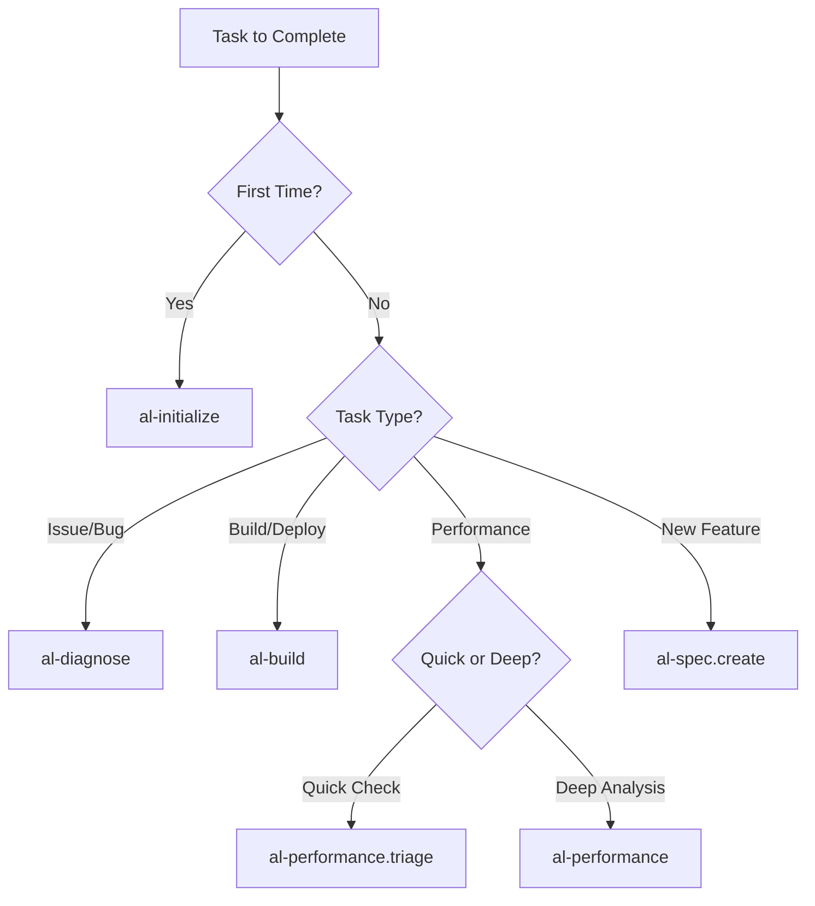

# Agentic Workflows - Layer 2: Agent Primitives

**Complete execution processes** implemented as `.prompt.md` files providing **systematic workflows** for specific AL development tasks in Business Central.

## 📋 What Are Agentic Workflows?

Agentic Workflows (formerly called "prompts") are:
- **Task-specific execution processes** with step-by-step guidance
- **Complete workflows** from planning through validation
- **Tool-integrated** processes that can execute AL commands
- **Reusable templates** for common development scenarios

## 🎯 How to Use Agentic Workflows

Activate workflows explicitly when needed:
```markdown
@workspace use [workflow-name]

Examples:
@workspace use al-initialize
@workspace use al-diagnose
@workspace use al-build
```

## 📦 Available Workflows (18 files)

### Environment & Setup

| File | Purpose | When to Use |
|------|---------|-------------|
| **al-initialize** | Complete environment and workspace initialization | First-time setup, new projects, onboarding |

### Development & Diagnostics

| File | Purpose | When to Use |
|------|---------|-------------|
| **al-diagnose** | Runtime debugging and configuration troubleshooting | Debugging issues, auth problems, symbol errors |
| **al-spec.create** | Create functional specifications | Planning new features |
| **al-pages** | Design and implement page objects | Creating UI components |
| **al-events** | Implement event publishers/subscribers | Extending BC without modifying base |

### Build & Deployment

| File | Purpose | When to Use |
|------|---------|-------------|
| **al-build** | Build, package, and deploy extensions | Building for release, deployment |
| **al-permissions** | Generate permission sets | Setting up security |
| **al-migrate** | Data migration strategies | Moving data between systems/versions |

### Quality & Performance

| File | Purpose | When to Use |
|------|---------|-------------|
| **al-performance.triage** | Quick performance diagnosis (static analysis) | Rapid performance assessment, code review |
| **al-performance** | Deep performance analysis (runtime profiling) | Slow queries, bottlenecks, optimization |

### Code Review & Documentation

| File | Purpose | When to Use |
|------|---------|-------------|
| **al-pr-prepare** | Prepare pull request documentation | Before code review/merge |
| **al-context.create** | Generate project context.md file | Setting up project for AI assistants |
| **al-memory.create** | Generate/update memory.md file | Maintaining session continuity |

### AI/Copilot Features

| File | Purpose | When to Use |
|------|---------|-------------|
| **al-copilot-capability** | Register Copilot capability | Adding AI features to BC |
| **al-copilot-promptdialog** | Create PromptDialog pages | Building Copilot UI |
| **al-copilot-test** | Test Copilot features | Validating AI functionality |
| **al-copilot-generate** | Generate Copilot code from natural language | Creating AI-powered features |

### Translation & Localization

| File | Purpose | When to Use |
|------|---------|-------------|
| **al-translate** | XLF translation file management | Localization workflows |

> **Note**: Total of 18 workflow files matching the prompts/ directory contents.

## 🏗️ Workflow Structure

Each workflow follows this pattern:

### 1. Objective
Clear statement of what the workflow accomplishes

### 2. Prerequisites
- Required context (files, settings)
- Required tools
- Required knowledge

### 3. Step-by-Step Process
Detailed instructions with:
- Context gathering
- Analysis phase
- Implementation steps
- Validation gates

### 4. Validation Criteria
How to verify success

### 5. Common Issues & Solutions
Troubleshooting guide

## 💡 Best Practices

### Choosing the Right Workflow



### Workflow Combinations

Common workflow sequences:

1. **New Feature Development**
   ```
   al-spec.create → al-pages → al-events → al-build → al-diagnose
   ```

2. **Performance Issue**
   ```
   al-performance.triage → al-performance → al-build
   ```

3. **Security Setup**
   ```
   al-permissions → al-build → al-diagnose
   ```

4. **Integration Work**
   ```
   al-events → al-migrate → al-build → al-diagnose
   ```

5. **First-Time Setup**
   ```
   al-initialize → al-spec.create → al-build
   ```

### Integration with Other Primitives

Workflows complement:
- **Instructions** - Automatically loaded context during workflow execution
- **Agents** - Strategic consultation before/after workflow execution
  - Use `al-architect` to design before implementing workflow (entry point for new features)
  - Use `al-conductor` for TDD orchestration on medium/high complexity tasks
  - Use `al-debugger` when workflow execution reveals issues

## 🔄 Workflow Evolution

This collection has evolved to optimize clarity and completeness:

### Current State (v2.8)

**18 Agentic Workflows:**

1. `al-initialize` - Environment & workspace setup
2. `al-diagnose` - Debug & troubleshoot  
3. `al-build` - Build/package/deploy
4. `al-events` - Event implementation
5. `al-performance` - Deep performance profiling
6. `al-performance.triage` - Quick performance check
7. `al-permissions` - Permission set generation
8. `al-migrate` - Version migration
9. `al-pages` - Page design & UI
10. `al-spec.create` - Functional specifications
11. `al-pr-prepare` - Pull request preparation
12. `al-context.create` - Project context generation
13. `al-memory.create` - Session memory management
14. `al-copilot-capability` - Copilot capability registration
15. `al-copilot-promptdialog` - PromptDialog creation
16. `al-copilot-test` - Copilot feature testing
17. `al-copilot-generate` - AI code generation
18. `al-translate` - XLF translation management

### Historical Changes

**v2.3 Consolidations:**
- `al-setup` + `al-workspace` → **al-initialize**
- `al-debug` + `al-troubleshoot` → **al-diagnose**

**v2.7 Additions:**
- `al-context.create` - Project context for AI assistants
- `al-memory.create` - Session continuity
- `al-copilot-generate` - Natural language code generation

## 🔗 Related Resources

- **Collection Manifest**: `collections/al-development.collection.yml`
- **Framework Reference**: `docs/framework/ai-native-instructions-architecture.md`
- **User Guide**: `al-development.md`
- **Contributing**: `CONTRIBUTING.md`

## 📊 Validation

Run `npm run validate` to verify:
- All workflow files exist
- Frontmatter is properly formatted
- File naming conventions are followed
- Required fields are present

## 🎯 Quick Reference

| Need to... | Use Workflow |
|-----------|--------------|
| Set up new project/environment | `al-initialize` |
| Debug or troubleshoot issues | `al-diagnose` |
| Build & deploy | `al-build` |
| Fix performance issues | `al-performance.triage` → `al-performance` |
| Create new feature | `al-spec.create` → `al-pages` |
| Add events | `al-events` |
| Set up security | `al-permissions` |
| Migrate data | `al-migrate` |
| Prepare for review | `al-pr-prepare` |

---

**Framework Compliance**: These workflows implement **AI-Native Instructions Architecture** - Layer 2 (Agent Primitives) providing systematic execution processes that coordinate Instructions and Agents for complete task fulfillment.

**Version**: 2.8.0
**Total Workflows**: 18
**Last Updated**: 2025-11-25
